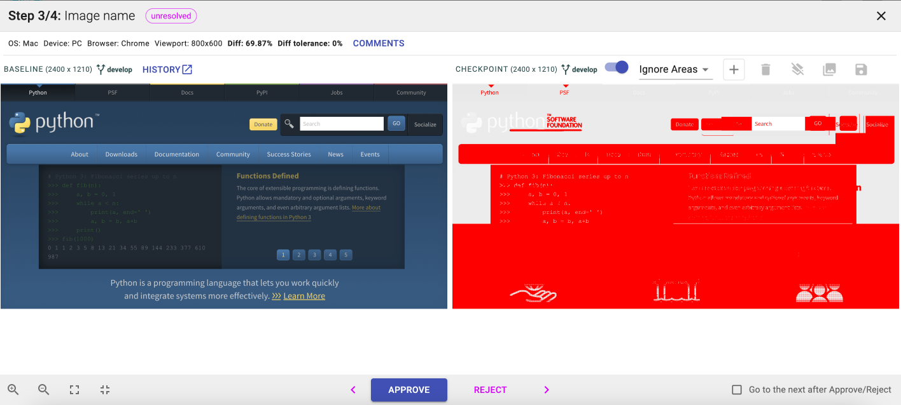

# Visual Regression Tracker with Python, Selenium and Pytest
https://github.com/Visual-Regression-Tracker/Visual-Regression-Tracker

## How to run

1. Install dependencies `$  pip install -r requirements.txt`
2. Run tests `$ python test_example.py`
